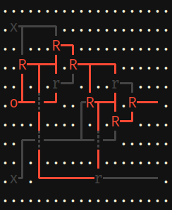

# Short Circuit

<p class="shields">
    <a href="https://hub.docker.com/r/amfl/short-circuit" alt="Docker Automated build">
        </a>
</p>

Short Circuit is a **tile-based digital logic sandbox** inspired by
[Wireworld][wireworld] and [Minecraft's Redstone][redstone].

It is in **pre-alpha**. Expect nothing to work!



## Quickstart

To load the demo [full adder file][full-adder]:

```bash
./docker-build.sh
./docker-run.sh

# View the help
python ./shortcircuit/main.py --help

# Load the demo - Press "o" over switches to toggle
#                 Press "." to advance the simulation
python ./shortcircuit/main.py --file data/full-adder.ssboard
```

**Controls**

- **arrow keys** or **h j k l** : Cursor movement
- **o** : Place/toggle switches
- **n** : Place/rotate NANDs
- **space** : Place wire/delete node
- **b** : Place a wire bridge
- **.** : Tick the simulation
- **w** : Write out current layout to disk
- **q** : Quit

[full-adder]: ./data/full-adder.ssboard

## Goals

- Give myself a fun project to work on
- Provide users with:
  - The bare minimum required components to be Turing complete
  - A graphical, tile-based editor which can be used to design a system without
    tedious drudgery
    - Easy to use means of encapsulating and reusing components
    - ["Applied Energistics" style][ae-p2p-bus] ways to push multiple
      signals through a single wire, and then unpack them at the other end
- Be able to "compile" a user design from graphical tiles to an in-memory graph
  representation so the system can be simulated without having to perform
  cellular automata evaluation
- Be able to parallelize the evaluation of large designs

[ae-p2p-bus]: https://ae-mod.info/P2P-Tunnel/
[wireworld]: https://en.wikipedia.org/wiki/Wireworld
[redstone]: https://minecraft.gamepedia.com/Redstone_Dust#Redstone_component

## Testing

Tests are written with the [`unittest` module][python-unittest] from the
Standard Python Library.

To run tests, you can simply run the test file that you are interested in:

```bash
export PYTHONPATH=${PYTHONPATH}:./shortcircuit
python3 ./shortcircuit/test/FILE_HERE.py
```

Or you can use [`pytest`][pytest-unittest] to call them all at once:

```bash
export PYTHONPATH=${PYTHONPATH}:./shortcircuit
pip install pytest
pytest ./shortcircuit/test/*
```

[python-unittest]: https://docs.python.org/3/library/unittest.html#module-unittest
[pytest-unittest]: https://docs.pytest.org/en/latest/unittest.html

## Development

Here's how I develop short-circuit if you would like to jump in and help!

I prefer to do my development with docker images, you may find it easier to
just use a [python venv][venv]. If you choose to use docker, there are two
convenience scripts in the repo to help get set up quickly.

- `docker-build.sh` : Builds the docker image with all the dependencies.
- `docker-run.sh` : Runs the docker image and mounts the source directory.

**My workflow**

1. Build the docker image as shown above
2. Run the docker image as shown above, which will place you at a bash prompt
3. Start a `tail -F ./output/gameplay.log` in another terminal to view logs
4. Hack on the source in your editor
5. Run the linter in the container with `flake8 ./shortcircuit`
6. Run the tests in the container with `pytest ./shortcircuit/tests/*`
7. Run the code in the container with `python ./shortcircuit/main.py`
8. GOTO 4

Because the source directory is mounted, it's possible to quickly hack on
source without having to rebuild everything.

[venv]: https://docs.python.org/3/library/venv.html

## Further Reading

If you like this project, you'll probably like these things too.

- [Logisim-evolution](https://github.com/reds-heig/logisim-evolution) - An educational tool for designing and simulating digital logic circuits
- [AsciiDots](https://github.com/aaronjanse/asciidots) - An esoteric programming language based on ascii art
